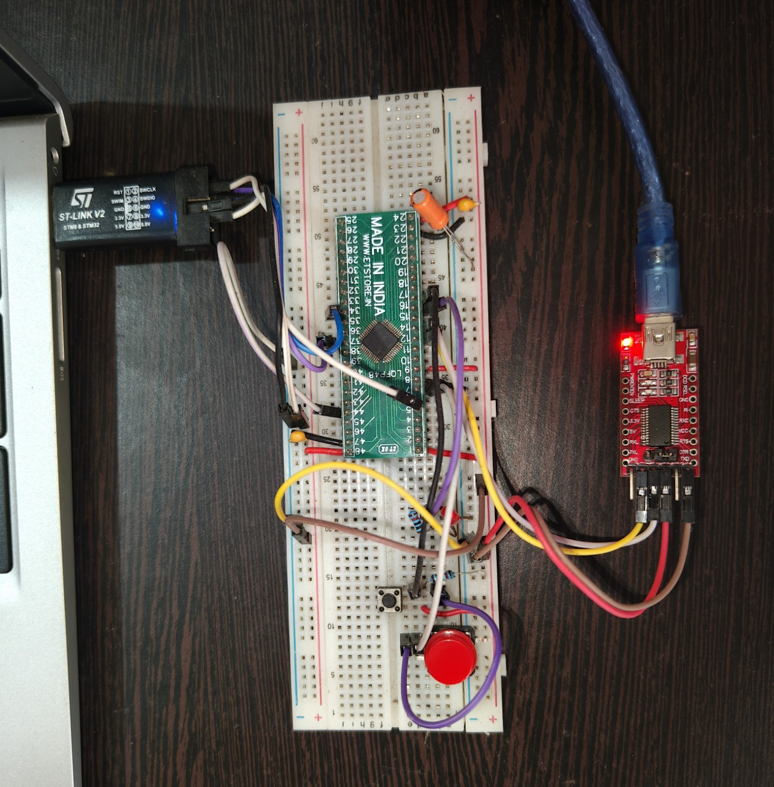
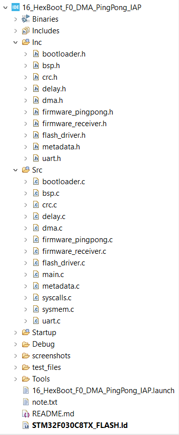
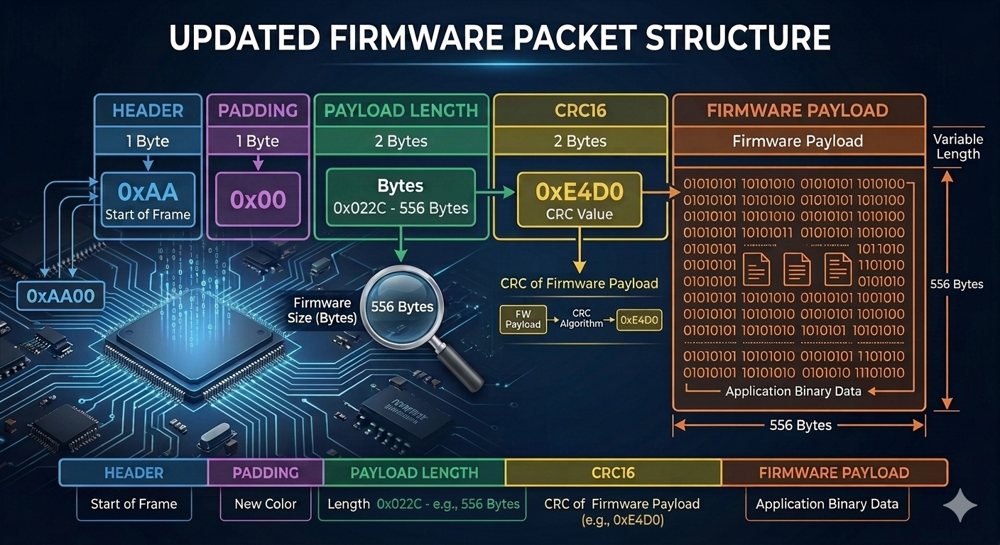
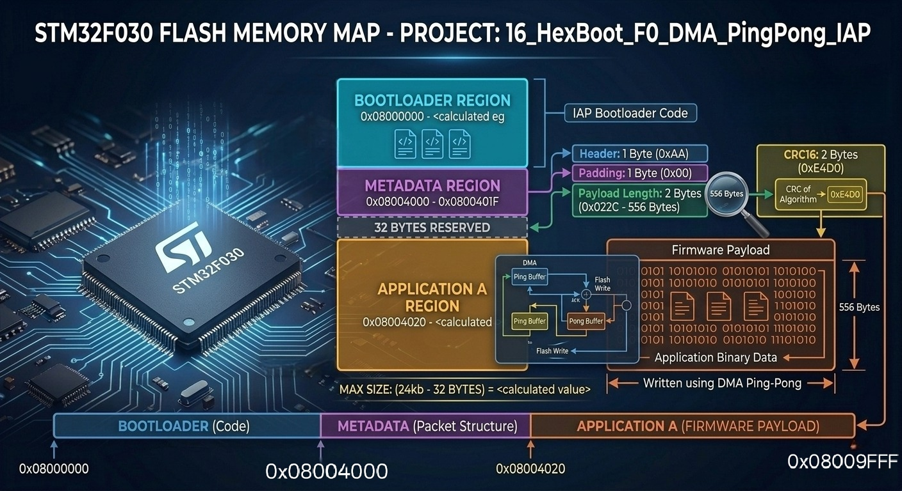
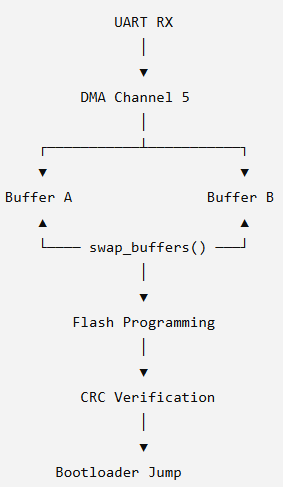
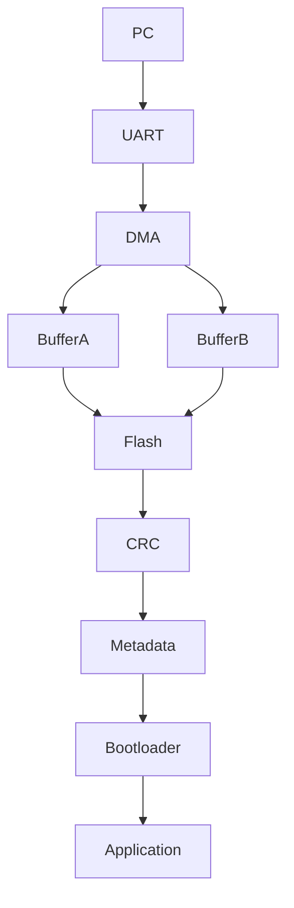
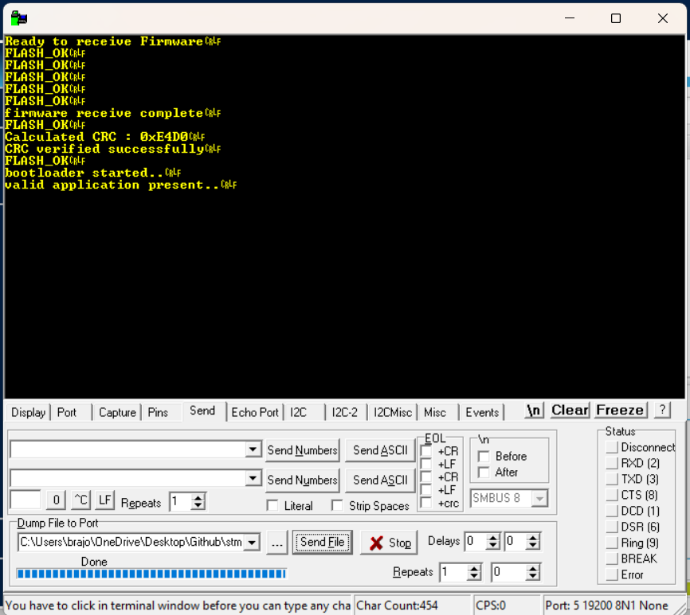
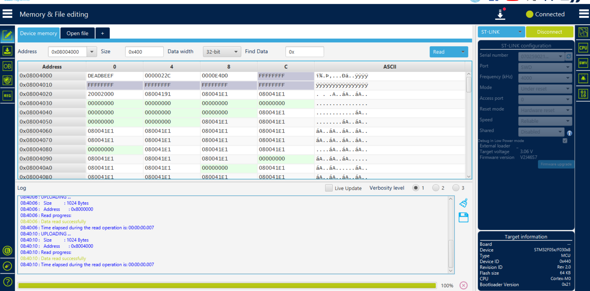

# Project 16 – STM32F0 DMA Ping-Pong IAP Bootloader

## Bare-Metal UART Bootloader

This project implements a **Bare-Metal UART Bootloader** for the **STM32F030C8T6** using **DMA-based firmware reception** and **Ping-Pong Buffering** for efficient and reliable firmware updates.

Unlike the previous interrupt-driven implementation, this project offloads UART reception to the DMA controller, significantly reducing CPU involvement during firmware transfer while allowing flash programming and data reception to operate independently.

This project represents the final feature implementation of the STM32F0 Bootloader series before the robustness and production validation phase.

---

# Features

- Bare-Metal STM32F030 Bootloader
- Register-Level Programming (No HAL / No CubeMX)
- UART DMA Firmware Reception
- Ping-Pong Buffering
- Flash Programming
- Flash Verification
- CRC16 Firmware Validation
- Metadata Management
- Automatic Bootloader to Application Jump
- Modular Driver Architecture

---

# Hardware Platform

Unlike many STM32 projects that rely on development boards, this project was developed using a **standalone STM32F030C8T6 MCU soldered onto a breakout board**.

All peripherals including UART, SWD programming, buttons, LEDs, and power circuitry were manually connected on a breadboard to gain a deeper understanding of MCU hardware and board-level development.




---

# Project Structure



```
Inc/
│
├── bootloader.h
├── dma.h
├── flash_driver.h
├── firmware_pingpong.h
├── firmware_receiver.h
├── metadata.h
├── uart.h
└── ...

Src/
│
├── bootloader.c
├── dma.c
├── flash_driver.c
├── firmware_pingpong.c
├── firmware_receiver.c
├── metadata.c
├── uart.c
└── main.c
```

---

# Firmware Packet Structure

Firmware is transmitted using a custom packet format.



| Field | Size | Description |
|-------|------|-------------|
| Header | 2 Bytes | Start of firmware packet |
| Payload Length | 2 Bytes | Firmware size |
| CRC16 | 2 Bytes | Firmware CRC |
| Payload | Variable | Application Binary |

---

# Flash Memory Layout

The internal Flash is divided into dedicated regions for the Bootloader, Metadata and Application.



| Region | Purpose |
|---------|---------|
| Bootloader | UART DMA Bootloader |
| Metadata | Firmware Information |
| Application | User Firmware |

---

# DMA Ping-Pong Architecture

DMA continuously receives firmware while the CPU programs the previously received buffer into Flash.



```
UART RX
    │
    ▼
DMA Channel 5
    │
    ▼
Buffer A ⇄ Buffer B
    │
    ▼
Flash Programming
    │
    ▼
CRC Verification
    │
    ▼
Jump to Application
```

---

# Firmware Update Flow



---

# DMA Firmware Reception

The firmware is received in multiple DMA transfers.

Each completed DMA transfer:

- Swaps the Ping-Pong buffers
- Programs the previous buffer into Flash
- Starts the next DMA reception automatically


---

# Successful Firmware Update

After all firmware chunks are received:

- Flash Programming completes
- CRC is verified
- Metadata is updated
- Bootloader validates the application
- Control is transferred to the application



---

# Flash Verification

The programmed firmware can be verified directly using STM32CubeProgrammer.



---

# Testing

| Test | Status |
|-------|--------|
| DMA Reception | ✅ PASS |
| Ping-Pong Buffer | ✅ PASS |
| Flash Programming | ✅ PASS |
| Flash Verification | ✅ PASS |
| CRC Verification | ✅ PASS |
| Metadata Update | ✅ PASS |
| Bootloader Jump | ✅ PASS |

---

# Key Learning Outcomes

- DMA Configuration
- UART DMA Reception
- Ping-Pong Buffer Design
- Flash Memory Programming
- Flash Verification
- CRC16 Implementation
- Metadata Management
- Bootloader Architecture
- Register-Level Programming
- Embedded State Machine Design

---

# Current Limitations

- UART is the only firmware transport interface.
- Firmware authentication is not implemented.
- Firmware encryption is not implemented.
- Single application slot.
- No rollback mechanism.

---

# Future Improvements

- Secure Boot
- Firmware Authentication
- Firmware Encryption
- BLE Firmware Update
- Wi-Fi Firmware Update
- CAN Bootloader
- USB DFU Support
- Dual Image Bootloader
- Rollback Recovery

---

# Bootloader Evolution

```
Project 12
Streaming IAP
        │
        ▼
Project 13
UART Interrupt IAP
        │
        ▼
Project 14
State Machine IAP
        │
        ▼
Project 15
Ping-Pong Buffer IAP
        │
        ▼
Project 16
DMA Ping-Pong IAP
```

Each project introduced one major architectural improvement while maintaining a fully Bare-Metal implementation.

---

# Project Information

| Item | Details |
|------|---------|
| MCU | STM32F030C8T6 |
| Core | ARM Cortex-M0 |
| Language | C |
| Programming Style | Bare Metal |
| IDE | STM32CubeIDE |
| Programmer | ST-Link V2 |
| Communication | UART + DMA |
| License | MIT |

---

This project is part of my **STM32 Bare-Metal Learning Journey**, focused on understanding STM32 peripherals, bootloader design, and embedded systems development using register-level programming without relying on vendor libraries.