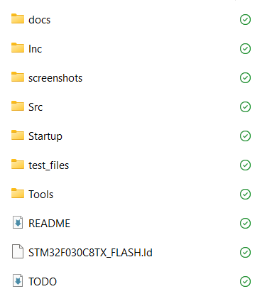
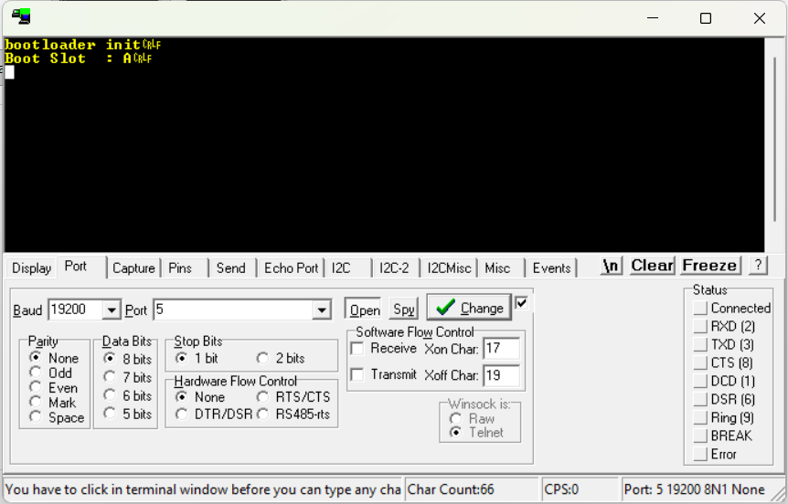
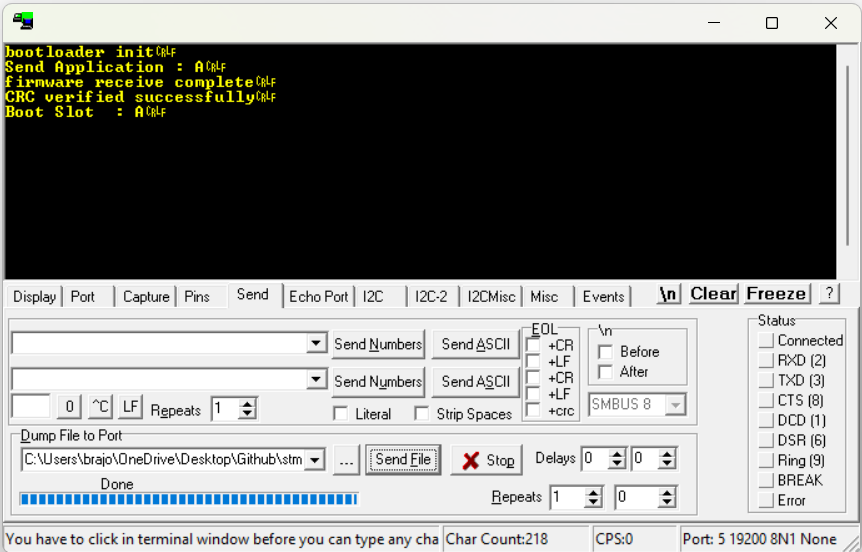
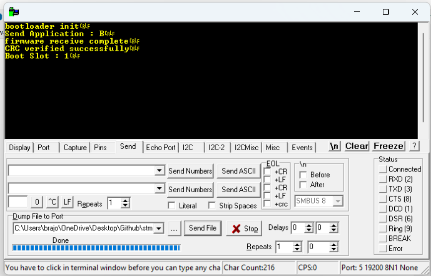
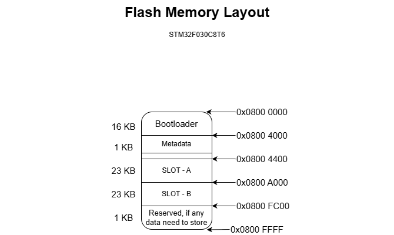
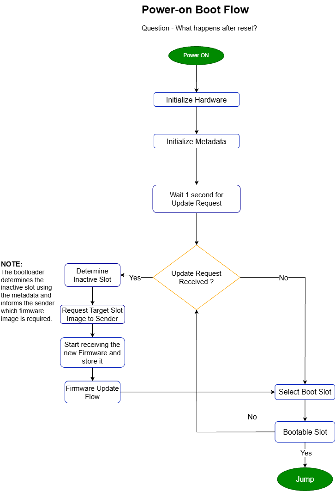
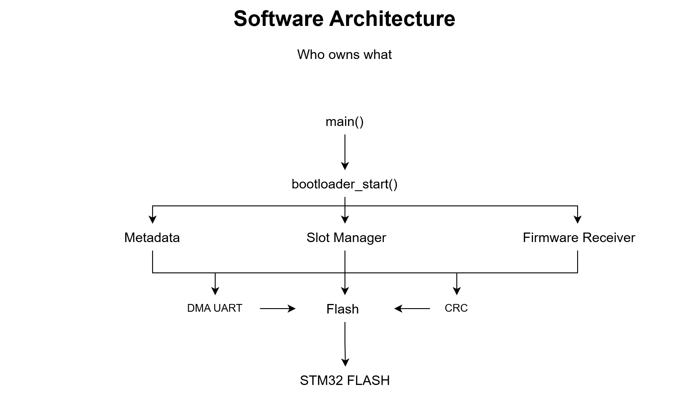
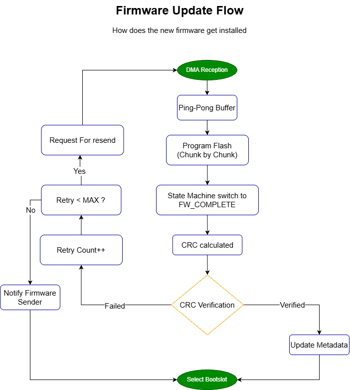

# Project 17 - HexBoot_F0 Failsafe Dual-Slot Bootloader

A bare-metal dual-slot bootloader for the **STM32F030C8T6** written without **HAL** or **CubeMX**.

## Features

- Dual-slot firmware update
- UART + DMA firmware transfer
- Ping-Pong buffer
- CRC16 verification
- Metadata management
- Automatic slot selection
- Boot timeout
- Failsafe recovery

---

## Project Structure



---

## Bootloader



---

## Slot A Update



---

## Slot B Update



---

## Memory Layout



---

## Boot Flow



---

## Software Architecture



---

## Firmware Update Flow



---

## Folder Structure

```text
Inc/            Header files
Src/            Source files
Startup/        Startup code
docs/           Documentation
screenshots/    Project images
test_files/     Test firmware
Tools/          Python utilities
```

---

## Documentation

- Architecture Diagram
- Boot Flow
- Firmware Update Flow
- Memory Layout

See the **docs/** folder.

---

## Tools

The **Tools/** folder contains the Python utility used to generate the firmware header.

---

## License

MIT License